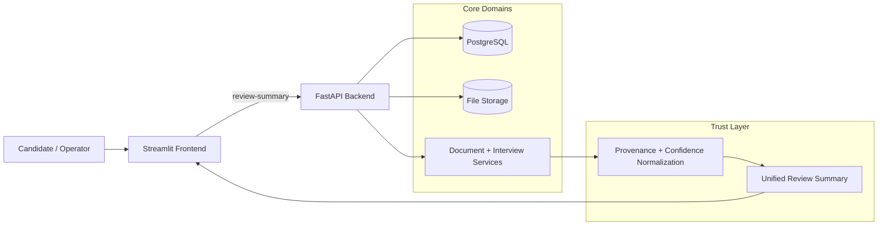

# Architecture Diagram

## Reading Guide

- The frontend reads the unified review payload.
- The backend keeps provenance and confidence normalization inside the trust layer.
- The UI should not reconstruct internal state from storage fields.
