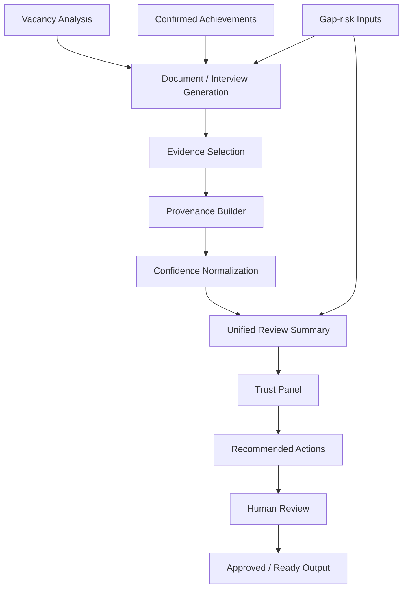

# Trust Flow Diagram

## Notes

- Gap-risk items remain visible until a human resolves them.
- Confidence levels are deterministic, not ML-scored in this baseline.
- Recommended actions are derived from blockers, warnings, unsupported claims, and low-confidence evidence.
