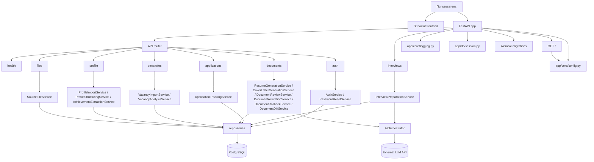

# Структура проекта

Этот документ описывает текущую структуру `career-copilot`, роли основных папок и то, как проходят ключевые запросы внутри backend.

## Общая архитектура



## Корневая структура

```text
career-copilot/
├── README.md
├── MVP_RUNBOOK.md
├── RUNBOOK.md
├── pyproject.toml
├── alembic.ini
├── .env.example
├── build_backend.py
├── Dockerfile
├── app/
├── alembic/
├── frontend/
├── docs/
├── scripts/
├── infra/
├── tests/
└── data/
```

## Папка `app/`

Основной backend-код. Здесь живут HTTP-роуты, сервисы, модели, репозитории, схемы и инфраструктурные модули.

```text
app/
├── __init__.py
├── ai/
├── api/
├── core/
├── db/
├── domain/
├── models/
├── repositories/
├── schemas/
├── security/
├── services/
├── tasks/
├── workflows/
└── main.py
```

### `app/main.py`

Точка входа FastAPI-приложения.

- создает приложение через `create_app()`
- поднимает `lifespan`
- включает общий API router из `app/api/router.py`
- отдельно подключает `app/api/routes/interviews.py` под префиксом `/api/v1`
- использует настройки из `app/core/config.py`
- добавляет корневой `GET /`, который возвращает service name и `status: ok`

### `app/api/`

HTTP-слой приложения.

```text
app/api/
├── __init__.py
├── dependencies.py
├── router.py
└── routes/
    ├── __init__.py
    ├── health.py
    ├── auth.py
    ├── files.py
    ├── profile.py
    ├── vacancies.py
    ├── documents.py
    ├── applications.py
    └── interviews.py
```

- `router.py` собирает основные роутеры в общий API.
- `routes/health.py` отвечает за healthcheck.
- `routes/auth.py` содержит register/login/refresh/logout/logout-all, password reset и `GET /auth/me`.
- `routes/files.py` принимает upload файлов.
- `routes/profile.py` запускает импорт резюме, структурирование профиля, извлечение достижений и review достижений.
- `routes/vacancies.py` импортирует вакансии, читает vacancy, запускает анализ и матчинг.
- `routes/documents.py` генерирует резюме и cover letter, умеет enhance, review, history, diff, activation, rollback, export и получение активного документа.
- `routes/applications.py` создает заявки, читает их, возвращает timeline и обновляет статусы.
- `routes/interviews.py` управляет interview sessions, answers, генерацией вопросов, оценкой ответов, AI-coaching и progress по вопросам.
- `dependencies.py` содержит shared dependencies, включая `get_ai_orchestrator()` и `get_current_dev_user()`.

### `app/security/`

Переиспользуемые security helpers для auth, паролей и токенов.

```text
app/security/
├── auth.py
├── dependencies.py
├── passwords.py
└── tokens.py
```

- `dependencies.py` содержит `get_current_active_user()` на основе Bearer token.
- `passwords.py` хранит argon2-хелперы для hashing и verification паролей.
- `tokens.py` генерирует access/refresh tokens и их SHA-256 hash.
- `auth.py` и соседние модули поддерживают session management и auth flow.

### `app/core/`

Общие настройки и сквозные сервисы.

```text
app/core/
├── config.py
└── logging.py
```

- `config.py` хранит Pydantic settings.
- `logging.py` настраивает логирование для приложения.

### `app/db/`

База данных и session management.

```text
app/db/
├── __init__.py
├── base.py
└── session.py
```

- `base.py` содержит SQLAlchemy Base.
- `session.py` создает `engine`, `AsyncSessionLocal` и dependency `get_db_session`.

### `app/domain/`

Доменные константы и правила, которые не относятся к ORM или HTTP.

```text
app/domain/
└── application_statuses.py
```

- `application_statuses.py` хранит допустимые статусы заявок и правила переходов между ними.

### `app/models/`

ORM-модели предметной области.

```text
app/models/
├── __init__.py
└── entities.py
```

`entities.py` содержит основные таблицы:

- `User`
- `CandidateProfile`
- `CandidateExperience`
- `CandidateAchievement`
- `SourceFile`
- `FileExtraction`
- `Vacancy`
- `VacancyAnalysis`
- `DocumentVersion`
- `ApplicationRecord`
- `ApplicationStatusHistory`
- `InterviewSession`
- `InterviewAnswerAttempt`
- `AIRun`
- `RefreshSession`
- `AuthEvent`
- `PasswordResetToken`

### `app/repositories/`

Слой доступа к данным. Здесь находятся SQLAlchemy-запросы и операции CRUD.

```text
app/repositories/
├── ai_run_repository.py
├── application_record_repository.py
├── application_status_history_repository.py
├── candidate_achievement_repository.py
├── candidate_profile_repository.py
├── document_version_repository.py
├── file_extraction_repository.py
├── interview_session_repository.py
├── source_file_repository.py
├── user_repository.py
├── vacancy_analysis_repository.py
└── vacancy_repository.py
```

Назначение основных репозиториев:

- `user_repository.py` - поиск и создание пользователей.
- `source_file_repository.py` - загрузка и чтение исходных файлов.
- `file_extraction_repository.py` - работа с извлечением текста из файлов.
- `candidate_profile_repository.py` - профиль кандидата и связанные данные.
- `candidate_achievement_repository.py` - создание, замена и review achievements.
- `vacancy_repository.py` - вакансии.
- `vacancy_analysis_repository.py` - анализ вакансий.
- `document_version_repository.py` - версии документов, активные документы, история и чтение документов для review/export.
- `application_record_repository.py` - application records и список откликов пользователя.
- `application_status_history_repository.py` - история статусных переходов заявок.
- `interview_session_repository.py` - interview sessions и попытки ответа.
- `ai_run_repository.py` - трассировка AI-вызовов.

### `app/schemas/`

Pydantic-модели для request/response и JSON contracts.

```text
app/schemas/
├── achievement_extract.py
├── application.py
├── auth.py
├── document.py
├── interview.py
├── json_contracts.py
├── profile_import.py
├── profile_structured.py
├── source_file.py
└── vacancy.py
```

Что покрывают схемы:

- `source_file.py` - read-модели файла.
- `profile_import.py` - импорт резюме из файла.
- `profile_structured.py` - результат структурирования профиля.
- `achievement_extract.py` - результат извлечения достижений и review-модели.
- `vacancy.py` - импорт и чтение вакансий, а также анализ.
- `document.py` - генерация, enhance, review, history, export, activation, rollback и diff.
- `application.py` - создание, чтение, список, timeline и обновление статусов заявок.
- `interview.py` - создание interview session, сохранение ответов, оценка, улучшение и progress.
- `auth.py` - схемы для аутентификации, сессий и сброса пароля.
- `json_contracts.py` - внутренние JSON-контракты для AI и interview flow.

### `app/services/`

Бизнес-логика. Роуты минимальны и делегируют основную работу сюда.

```text
app/services/
├── achievement_extraction_service.py
├── application_tracking_service.py
├── auth_service.py
├── cover_letter_generation_service.py
├── document_activation_service.py
├── document_diff_service.py
├── document_review_service.py
├── document_rollback_service.py
├── interview_preparation_service.py
├── password_reset_service.py
├── profile_builder_service.py
├── profile_import_service.py
├── profile_structuring_service.py
├── resume_generation_service.py
├── resume_parser_service.py
├── source_file_service.py
├── storage_service.py
├── vacancy_analysis_service.py
└── vacancy_import_service.py
```

Кратко по ответственности:

- `storage_service.py` - чтение и запись файлов в object storage.
- `resume_parser_service.py` - парсинг резюме.
- `source_file_service.py` - загрузка файла, поиск пользователя и создание source file.
- `profile_import_service.py` - запуск импорта профиля из source file.
- `profile_structuring_service.py` - извлечение структурированных данных и опыта.
- `profile_builder_service.py` - сборка и консолидация профиля кандидата из различных источников.
- `achievement_extraction_service.py` - извлечение достижений из raw текста с `fact_status = needs_confirmation`.
- `vacancy_import_service.py` - импорт вакансии из текста или URL.
- `vacancy_analysis_service.py` - анализ вакансии и сопоставление с профилем.
- `resume_generation_service.py` - генерация резюме под вакансию.
- `cover_letter_generation_service.py` - генерация cover letter.
- `document_review_service.py` - изменение review-статуса документа и опциональная активация при approval.
- `document_activation_service.py` - активация документов с деактивацией предыдущих версий.
- `document_rollback_service.py` - rollback документов к предыдущим версиям.
- `document_diff_service.py` - сравнение двух версий документа.
- `application_tracking_service.py` - создание заявок, проверка approved-пакета документов, список заявок и статусные переходы.
- `interview_preparation_service.py` - построение interview session, deterministic feedback, readiness score, AI-улучшение ответов и AI-коучинг между попытками.
- `auth_service.py` - управление сессиями аутентификации, refresh tokens и events.
- `password_reset_service.py` - генерация и валидация токенов сброса пароля.

### `app/ai/`

Core AI layer для LLM orchestration. Это не часть API.

```text
app/ai/
├── clients/
│   ├── base.py
│   └── gigachat.py
├── registry/
│   └── prompts.py
├── use_cases/
│   ├── __init__.py
│   ├── cover_letter_enhance.py
│   ├── interview_coach.py
│   ├── resume_enhance.py
│   └── resume_tailoring.py
├── config.py
├── factory.py
├── orchestrator.py
└── tracing.py
```

- `clients/base.py` задает абстрактный интерфейс LLM-клиента.
- `clients/gigachat.py` реализует клиент для GigaChat API.
- `registry/prompts.py` хранит версионированные промпты и их спецификации.
- `use_cases/` содержит тонкий слой функций, который формирует `prompt_vars` и вызывает orchestrator.
- `factory.py` создает `AIOrchestrator`.
- `orchestrator.py` отвечает за retry, fallback, structured output, tracing и cost tracking.
- `tracing.py` сохраняет AI runs в БД.

### Где используется AI

AI вызывается из сервисов через `app/ai/use_cases/`, а не напрямую из роутов.

- `ResumeGenerationService` → `resume_tailoring.py` и `resume_enhance.py`
- `CoverLetterGenerationService` → `cover_letter_enhance.py`
- `InterviewPreparationService` → `interview_coach.py`

### Поток вызова

```text
service → use_case(
    orchestrator: AIOrchestrator,
    session,
    domain_objects...
) → orchestrator.execute(
    prompt_template: PromptTemplate,
    prompt_vars: dict,
    workflow_name: str,
    target_type: str,
) → LLMClient.generate_structured() → provider API
```

**Правило:** сервис не знает про `PromptTemplate`, не формирует `prompt_vars` и не вызывает `orchestrator.execute()` напрямую. Вся AI-специфика централизована в `use_cases/`.

### Dependency rules

- `services → ai` ✅
- `ai → services` ❌
- `ai → repositories` ❌, кроме tracing через `AIRunRepository` внутри `orchestrator.py`
- `routes → ai` ❌, только через services

### Зафиксированные архитектурные решения

#### 1. Prompt registry с версиями

Каждый промпт - это `PromptTemplate.V1`, а не просто строка.

#### 2. PromptSpec как DSL

Каждый промпт описан структурой:

```python
@dataclass(frozen=True)
class PromptSpec:
    template: str
    input_schema: dict
    output_schema: dict
    model_hint: str | None
    temperature_hint: float | None
```

#### 3. Fact-safety в генерации документов

AI видит только подтвержденные достижения. В `ResumeGenerationService` и `CoverLetterGenerationService` используются только записи со статусом `confirmed`.

#### 4. Orchestrator как единая точка входа

Все AI-вызовы идут через `AIOrchestrator.execute()`. Сервисы не должны обходить retry, fallback, validation и tracing.

## Папка `frontend/`

Streamlit-интерфейс и HTTP-клиент для работы с backend.

```text
frontend/
└── streamlit/
    ├── __init__.py
    ├── api_client.py
    └── app.py
```

- `app.py` содержит full MVP UI flow.
- `app.py` также содержит human-in-the-loop review достижений и UI для документов, заявок и интервью.
- `api_client.py` инкапсулирует вызовы backend API, включая JSON-запросы и export в TXT/MD/DOCX.

## Папка `scripts/`

Утилиты для локальной проверки и отладки.

```text
scripts/
├── check_ai_runs.py
├── debug_vacancy_analysis_parser.py
├── dev_db_counts.py
├── dev_db_reset.py
├── import_analyze_vacancy_utf8.py
├── list_recent_vacancy_analyses.py
├── smoke_mvp_flow.py
├── test_orchestrator_break.py
├── test_orchestrator_manual.py
└── verify_pdf_extraction_utf8.py
```

- `smoke_mvp_flow.py` прогоняет deterministic MVP baseline.
- Остальные скрипты помогают с локальной отладкой данных, AI runs и extraction пайплайна.

## Папка `alembic/`

Миграции базы данных.

```text
alembic/
├── env.py
├── script.py.mako
└── versions/
    ├── 1458eac2b109_add_tokens_used_json_to_ai_runs.py
    ├── 3c7e9f2a8b4d_auth_hardening_adjustments.py
    ├── 5505206e59d7_add_analysis_id_to_document_versions.py
    ├── 559468b67048_add_interview_answer_attempts_table.py
    ├── 6b8d2f4a1c01_add_unique_constraint_application_user_vacancy.py
    ├── 8f1a2b3c4d5e_add_auth_events.py
    ├── 90ce6c62745c_add_application_status_history.py
    ├── 9a7b6c5d4e3f_add_updated_at_to_refresh_sessions.py
    ├── 9de02e41efad_initial_schema.py
    ├── a1b2c3d4e5f6_add_auth_fields_and_refresh_sessions.py
    ├── b2c3d4e5f6a7_add_password_reset_tokens.py
    ├── b8e0b417ae85_add_provider_name_to_ai_runs.py
    ├── badc1805f0ba_password_reset_token_indexes.py
    └── c5e1b2062553_add_file_extractions.py
```

- `env.py` подключает Alembic к модели и настройкам проекта.
- `versions/` хранит миграции схемы.

## Папка `infra/`

Инфраструктурные файлы.

```text
infra/
└── docker/
    ├── docker-compose.yml
    └── import_resume.json
```

Здесь лежит локальная docker-compose конфигурация и вспомогательные файлы для запуска окружения.

## Папка `docs/`

Документация проекта.

```text
docs/
├── project-structure.md
└── local-operational-routine.md
```

- `project-structure.md` - текущий документ со структурой проекта.
- `local-operational-routine.md` - инструкции по локальной эксплуатации и отладке.

## Папка `tests/`

Тесты проекта. Набор включает smoke, service, API и migration checks.

```text
tests/
├── conftest.py
├── test_access_scope.py
├── test_achievement_extraction_service.py
├── test_achievement_proof_review_api.py
├── test_application_list_api.py
├── test_application_package_integrity.py
├── test_application_status_api_flow.py
├── test_application_status_transitions.py
├── test_auth_audit.py
├── test_auth_sessions.py
├── test_cover_letter_generation_service.py
├── test_document_active_resolution.py
├── test_document_activate.py
├── test_document_content_json_audit.py
├── test_document_docx_export_api.py
├── test_document_export_api.py
├── test_health.py
├── test_interview_answer_feedback_service.py
├── test_interview_answers_api_flow.py
├── test_interview_api_flow.py
├── test_interview_preparation_service.py
├── test_interview_session_list_api.py
├── test_migration_drift.py
├── test_mvp_flow_e2e.py
├── test_password_reset.py
├── test_profile_pipeline.py
├── test_profile_structuring_service.py
├── test_resume_generation_service.py
├── test_resume_parser_service.py
├── test_vacancy_analysis_api_flow.py
├── test_vacancy_analysis_service.py
└── test_vacancy_import_service.py
```

Общие фикстуры находятся в `conftest.py`.

## Папка `data/`

Локальное хранилище для данных и артефактов.

```text
data/
└── ...
```

Используется для хранения локальных файлов, кэшированных данных и временных артефактов.

## Основные потоки данных

### 1. Загрузка файла

1. Клиент вызывает `POST /files/upload`.
2. `app/api/routes/files.py` передает запрос в `SourceFileService`.
3. `SourceFileService` находит или создает `User` по email.
4. Файл сохраняется в storage.
5. В базе создается `SourceFile`.

### 2. Импорт и структурирование резюме

1. Клиент вызывает `POST /profile/import-resume`.
2. `ProfileImportService` берет `SourceFile`, скачивает файл и парсит текст.
3. Создается `FileExtraction`.
4. Далее `POST /profile/extract-structured` запускает `ProfileStructuringService`.
5. Сервис заполняет `CandidateProfile` и `CandidateExperience`.

### 3. Извлечение и review достижений

1. Клиент вызывает `POST /profile/extract-achievements`.
2. `AchievementExtractionService` читает `FileExtraction`.
3. Из текста формируются `CandidateAchievement`.
4. Каждое новое достижение получает `fact_status = needs_confirmation`.
5. Пользователь проверяет, редактирует и подтверждает достижения.
6. Клиент вызывает `PATCH /profile/achievements/{achievement_id}/review`.
7. Подтвержденные достижения получают `fact_status = confirmed`.

В Streamlit шаг импорта вакансии блокируется, пока все извлеченные достижения не подтверждены.

### 4. Вакансии

1. Клиент вызывает `POST /vacancies/import`.
2. `VacancyImportService` ищет или создает пользователя.
3. Создается `Vacancy`.
4. Затем `POST /vacancies/{id}/analyze` или `POST /vacancies/{id}/match` запускает `VacancyAnalysisService`.
5. Результат сохраняется в `VacancyAnalysis`.

### 5. Генерация документов

1. Клиент вызывает `POST /documents/resumes/generate` или `POST /documents/letters/generate`.
2. Сервисы читают вакансию, профиль и анализ.
3. `ResumeGenerationService` и `CoverLetterGenerationService` выбирают только `confirmed` achievements.
4. `needs_confirmation` achievements не попадают в `selected_achievements` и `rendered_text`.
5. Создается `DocumentVersion` в статусе `draft`.
6. Далее документ проходит review через `PATCH /documents/{document_id}/review`.
7. После approval документ можно активировать через `POST /documents/{document_id}/activate`.
8. Активация деактивирует предыдущие активные версии того же типа документа.
9. Активный документ можно получить через `GET /documents/active`.
10. Документ можно откатить к предыдущей версии через `POST /documents/{document_id}/rollback`.
11. После approval и активации документ можно экспортировать через `GET /documents/{document_id}/export/{format}`.
12. Поддерживаются форматы `txt`, `md` и `docx`.

### 6. Заявки

1. Клиент вызывает `POST /applications`.
2. `ApplicationTrackingService` создаёт `ApplicationRecord`.
3. `GET /applications` возвращает список заявок пользователя.
4. `GET /applications/{application_id}/timeline` возвращает историю статусных переходов.
5. `PATCH /applications/{application_id}/status` обновляет статус по разрешенным переходам.

### 7. Подготовка к интервью

1. Клиент вызывает `POST /api/v1/interviews/sessions`.
2. `InterviewPreparationService` строит набор вопросов на основе вакансии, анализа и профиля.
3. Клиент сохраняет ответы через `PATCH /api/v1/interviews/sessions/{id}/answers`.
4. Сервис считает feedback и readiness score.
5. `POST /api/v1/interviews/sessions/{id}/evaluate` сохраняет попытку ответа и оценивает ее.
6. `POST /api/v1/interviews/sessions/{id}/coach` улучшает ответ с помощью AI.
7. `GET /api/v1/interviews/sessions/{session_id}/questions/{question_id}/progress` возвращает прогресс по вопросу, включая AI-коучинг при наличии >= 2 попыток.

### 8. Аутентификация и управление сессиями

1. Клиент вызывает `POST /api/v1/auth/login` с учетными данными.
2. `AuthService` создает session и возвращает access token.
3. Access token используется в заголовке `Authorization: Bearer <token>`.
4. Refresh token позволяет получать новые access tokens.
5. События аудита логируются для мониторинга безопасности.

### 9. Сброс пароля

1. Клиент вызывает `POST /api/v1/auth/password-reset/request` для запроса сброса.
2. `PasswordResetService` генерирует токен и отправляет ссылку.
3. Клиент вызывает `POST /api/v1/auth/password-reset/confirm` с токеном и новым паролем.
4. Токен валидируется и пароль обновляется.

## Document Lifecycle и Single Active Version Invariant

### Document Lifecycle

Документы проходят через следующие стадии:

1. `draft`: создание черновика документа через AI.
2. Review: `draft` → `approved` / `rejected` / `needs_edit`.
3. Activation: `is_active = true` только для approved документов.
4. Deactivation: автоматическая деактивация при активации новой версии.
5. Rollback: возврат к предыдущей версии документа.

### Single Active Version Invariant

В рамках одного scope `(user + vacancy + document_kind)` может быть активна только одна версия документа.

- при активации новой версии автоматически деактивируются все предыдущие версии того же типа
- это гарантирует консистентность данных и предотвращает конфликты
- активный документ можно получить через `GET /documents/active`

### Document Activation Service

`DocumentActivationService` отвечает за:

- активацию документов с проверкой статуса `approved`
- деактивацию предыдущих версий в том же scope
- запись истории активаций в `content_json["activation"]`
- обновление `last_activated_at`

### Document Rollback Service

`DocumentRollbackService` позволяет:

- откатить документ к предыдущей версии
- создать новую версию на основе исходного документа
- сохранить историю изменений для аудита

### API Endpoints

- `POST /documents/{document_id}/activate` - активировать документ
- `GET /documents/active` - получить активный документ по типу
- `POST /documents/{document_id}/rollback` - откатить к предыдущей версии

## Что уже есть и что еще заготовлено

Есть:

- основной CRUD и доменная логика по профилю, вакансиям, документам, заявкам и интервью
- review API для достижений
- frontend gate, который блокирует импорт вакансии до подтверждения достижений
- backend safety filter, который использует в документах только `confirmed` achievements
- export API для approved+active документов в TXT/MD/DOCX
- активация документов с автоматической деактивацией предыдущих версий
- получение активного документа по типу и vacancy
- rollback документов к предыдущим версиям
- diff документов
- auth-слой с сессиями, refresh tokens и событиями аудита
- password reset flow с токенами
- отдельный `auth` route и слой security helpers
- `profile_builder_service.py` для сборки профиля
- Streamlit download-кнопки для экспорта документов
- application dashboard во frontend
- interview dashboard во frontend
- deterministic interview evaluation
- AI-улучшение ответов с safety guard
- AI-коучинг между попытками ответа
- статусные переходы откликов: `draft -> submitted -> interview/rejected/offer`
- PostgreSQL-схема через SQLAlchemy и Alembic
- healthcheck на `GET /health`
- корневой `GET /`, возвращающий `{"service": "...", "status": "ok"}`
- набор тестов для auth, password reset, application status transitions, document activation и integrity checks

Заготовлено:

- фоновые задачи в `tasks/`
- orchestration-слой в `workflows/`
- дальнейшее расширение AI use cases
- дополнительный Streamlit flow для новых сценариев MVP

## Текущий healthcheck

- `GET /health`
- ожидаемый ответ: `{"status":"ok"}`
