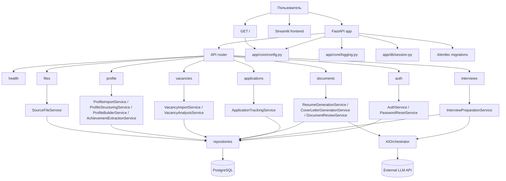

# Структура проекта

Этот документ описывает текущую структуру `career-copilot`, роли папок и то, как сейчас проходят основные запросы внутри backend.

## Общая архитектура



## Корневая структура

```text
career-copilot/
├── README.md
├── MVP_RUNBOOK.md
├── RUNBOOK.md
├── pyproject.toml
├── alembic.ini
├── .env.example
├── build_backend.py
├── Dockerfile
├── app/
├── alembic/
├── frontend/
├── docs/
├── scripts/
├── infra/
├── tests/
└── data/
```

## Папка `app/`

Основной backend-код. Здесь живут HTTP-роуты, сервисы, модели, репозитории, схемы и инфраструктурные модули.

```text
app/
├── __init__.py
├── api/
├── core/
├── db/
├── models/
├── repositories/
├── schemas/
├── security/
├── services/
├── tasks/
├── main.py
└── workflows/
```

### `app/main.py`

Точка входа FastAPI-приложения.

- создает приложение через `create_app()`
- поднимает `lifespan`
- включает основной router из `app/api/router.py`
- использует настройки из `app/core/config.py`
- добавляет корневой `GET /`, который возвращает service name и `status: ok`

### `app/api/`

HTTP-слой приложения.

```text
app/api/
├── dependencies.py
├── router.py
└── routes/
    ├── health.py
    ├── auth.py
    ├── files.py
    ├── profile.py
    ├── vacancies.py
    ├── documents.py
    ├── applications.py
    └── interviews.py
```

- `router.py` собирает все роутеры в общий API.
- `routes/health.py` отвечает за healthcheck.
- `routes/auth.py` содержит auth-ready endpoint для проверки auth-слоя.
- `routes/files.py` принимает upload файлов.
- `routes/profile.py` запускает импорт резюме, структурирование профиля, извлечение достижений и review достижений.
- `routes/vacancies.py` импортирует вакансии и запускает анализ.
- `routes/documents.py` генерирует резюме, cover letter, выполняет review документов и экспортирует approved-документы в TXT/MD/DOCX.
- `routes/applications.py` создает, читает, обновляет статусы и возвращает список application records для dashboard.
- `routes/interviews.py` создает interview session, возвращает список sessions, читает session, принимает ответы на вопросы, оценивает ответы и предоставляет AI-коучинг.
- `dependencies.py` содержит shared dependencies: `get_current_dev_user()`, `get_ai_orchestrator()`.

### `app/security/`

Переиспользуемые security helpers для auth, паролей и токенов.

```text
app/security/
├── auth.py
├── dependencies.py
├── passwords.py
└── tokens.py
```

- `auth.py` содержит `get_current_user_id()` для dev auth flow и session management.
- `dependencies.py` содержит FastAPI dependencies для аутентификации и авторизации.
- `passwords.py` хранит argon2-хелперы для hashing и verification паролей.
- `tokens.py` генерирует session tokens и их SHA-256 hash.

### `app/core/`

Общие настройки и сквозные сервисы.

```text
app/core/
├── config.py
└── logging.py
```

- `config.py` хранит Pydantic settings.
- `logging.py` настраивает логирование для приложения.

### `app/db/`

База данных и session management.

```text
app/db/
├── base.py
└── session.py
```

- `base.py` содержит SQLAlchemy Base.
- `session.py` создает `engine`, `AsyncSessionLocal` и dependency `get_db_session`.

### `app/models/`

ORM-модели предметной области.

```text
app/models/
├── __init__.py
└── entities.py
```

`entities.py` содержит основные таблицы:

- `User`
- `CandidateProfile`
- `CandidateExperience`
- `CandidateAchievement`
- `SourceFile`
- `FileExtraction`
- `Vacancy`
- `VacancyAnalysis`
- `DocumentVersion`
- `ApplicationRecord`
- `InterviewSession`
- `InterviewAnswerAttempt`
- `AIRun`

### `app/repositories/`

Слой доступа к данным. Здесь находятся SQLAlchemy-запросы и операции CRUD.

```text
app/repositories/
├── user_repository.py
├── source_file_repository.py
├── file_extraction_repository.py
├── candidate_profile_repository.py
├── candidate_achievement_repository.py
├── vacancy_repository.py
├── vacancy_analysis_repository.py
├── document_version_repository.py
├── application_record_repository.py
└── interview_session_repository.py
```

Назначение основных репозиториев:

- `user_repository.py` - поиск и создание пользователей.
- `source_file_repository.py` - загрузка и чтение исходных файлов.
- `file_extraction_repository.py` - работа с извлечением текста из файлов.
- `candidate_profile_repository.py` - профиль кандидата и связанные данные.
- `candidate_achievement_repository.py` - замена/создание достижений и обновление review-полей.
- `vacancy_repository.py` - вакансии.
- `vacancy_analysis_repository.py` - анализ вакансий.
- `document_version_repository.py` - версии документов, активные документы и чтение документов для review/export.
- `application_record_repository.py` - application records, поиск дублей и список откликов пользователя.
- `interview_session_repository.py` - interview session, ответы на интервью и попытки ответа.

### `app/schemas/`

Pydantic-модели для request/response.

```text
app/schemas/
├── source_file.py
├── profile_import.py
├── profile_structured.py
├── achievement_extract.py
├── vacancy.py
├── document.py
├── application.py
├── interview.py
└── auth.py
```

Что покрывают схемы:

- `source_file.py` - read-модель файла.
- `profile_import.py` - импорт резюме из файла.
- `profile_structured.py` - результат структурирования профиля.
- `achievement_extract.py` - результат извлечения достижений и read-модель review-полей.
- `vacancy.py` - импорт и чтение вакансий, а также анализ.
- `document.py` - генерация, review, чтение и экспорт документов.
- `application.py` - создание, чтение, список и обновление статусов заявок.
- `interview.py` - создание interview session, сохранение ответов, оценка, улучшение и прогресс попыток.
- `auth.py` - схемы для аутентификации, сессий и сброса пароля.

### `app/services/`

Бизнес-логика. Роуты минимальны и делегируют основную работу сюда.

```text
app/services/
├── storage_service.py
├── resume_parser_service.py
├── source_file_service.py
├── profile_import_service.py
├── profile_structuring_service.py
├── profile_builder_service.py
├── achievement_extraction_service.py
├── vacancy_import_service.py
├── vacancy_analysis_service.py
├── resume_generation_service.py
├── cover_letter_generation_service.py
├── document_review_service.py
├── application_tracking_service.py
├── interview_preparation_service.py
├── auth_service.py
└── password_reset_service.py
```

Кратко по ответственности:

- `storage_service.py` - чтение и запись файлов в object storage.
- `resume_parser_service.py` - парсинг резюме.
- `source_file_service.py` - загрузка файла, поиск пользователя и создание source file.
- `profile_import_service.py` - запуск импорта профиля из source file.
- `profile_structuring_service.py` - извлечение структурированных данных и опыта.
- `profile_builder_service.py` - сборка и консолидация профиля кандидата из различных источников.
- `achievement_extraction_service.py` - извлечение достижений из raw текста с `fact_status = needs_confirmation`.
- `vacancy_import_service.py` - импорт вакансии из текста или URL.
- `vacancy_analysis_service.py` - анализ вакансии и сопоставление с профилем.
- `resume_generation_service.py` - генерация резюме под вакансию.
- `cover_letter_generation_service.py` - генерация cover letter.
- `document_review_service.py` - изменение review-статуса документа.
- `application_tracking_service.py` - создание заявок, проверка approved-пакета документов, список заявок и статусные переходы.
- `interview_preparation_service.py` - построение interview session, feedback, readiness score, AI-улучшение ответов и AI-коучинг между попытками.
- `auth_service.py` - управление сессиями аутентификации, refresh tokens и events.
- `password_reset_service.py` - генерация и валидация токенов сброса пароля.

### `app/tasks/` и `app/workflows/`

Сейчас это заготовки под фоновые задачи и более крупные сценарии.

- `app/tasks/` - место для background jobs.
- `app/workflows/` - место для orchestration-слоя, если логика станет многошаговой.

### `app/ai/`

Core AI layer (LLM orchestration). **НЕ относится к API.**

Подробное описание структуры, контрактов и правил зависимостей см. в отдельном разделе **AI Layer (LLM Orchestration)** ниже.

## AI Layer (LLM Orchestration)

AI-слой отвечает за вызовы внешних LLM, retry / fallback, structured output, трассировку (`AI_RUNS`) и cost tracking.

**AI — это core-слой, а не часть API.** Сервисы используют его опционально через dependency injection.

### Структура

```text
app/ai/
├── clients/
│   ├── base.py          # BaseLLMClient (abstract)
│   └── gigachat.py      # GigaChatClient
├── registry/
│   └── prompts.py       # PromptTemplate, PromptSpec, PROMPT_REGISTRY
├── config.py            # AIOrchestratorConfig
├── factory.py           # create_ai_orchestrator() — единая точка входа
├── orchestrator.py      # AIOrchestrator (retry, fallback, tracing)
└── tracing.py           # trace_ai_run()
```

- `clients/base.py` — абстрактный интерфейс LLM-клиента (`BaseLLMClient`).
- `clients/gigachat.py` — реализация клиента для GigaChat API.
- `registry/prompts.py` — реестр промптов с версиями (`PromptTemplate`, `PromptSpec`).
- `config.py` — конфигурация AI-оркестратора (`AIOrchestratorConfig`).
- `factory.py` — единая точка создания `AIOrchestrator` (`create_ai_orchestrator()`). Все сервисы и роуты используют её через FastAPI dependency `get_ai_orchestrator()` из `app/api/dependencies.py`.
- `orchestrator.py` — retry, fallback, tracing, cost tracking.
- `tracing.py` — трассировка AI-запросов в БД (`AI_RUNS`).

### Где используется AI

AI вызывается из сервисов (не из роутов напрямую):

- `ResumeGenerationService` — AI-улучшение резюме (`RESUME_ENHANCE_V1`)
- `CoverLetterGenerationService` — AI-улучшение cover letter (`COVER_LETTER_ENHANCE_V1`)
- `InterviewPreparationService` — AI-коучинг ответов (`INTERVIEW_COACH_V1`, `INTERVIEW_COACHING_V1`)
- (дальше будет: `VacancyAnalysisService` v2)

### Поток вызова

```
service → AIOrchestrator.execute(
    prompt_template: PromptTemplate,
    prompt_vars: dict,
    workflow_name: str,
    target_type: str,
) → LLMClient.generate_structured() → provider API
```

### Dependency rules

- `services → ai` ✅
- `ai → services` ❌
- `ai → repositories` ❌ (кроме tracing через `AIRunRepository` внутри `orchestrator.py`)
- `routes → ai` ❌ (только через services)

Циклические зависимости между `ai` и `services` запрещены. Если AI-клиенту нужны данные — сервис должен их подготовить и передать в `prompt_vars`.

## Папка `frontend/`

Streamlit-интерфейс и HTTP-клиент для работы с backend.

```text
frontend/
└── streamlit/
    ├── __init__.py
    ├── api_client.py
    └── app.py
```

- `app.py` содержит full MVP UI flow.
- `app.py` также содержит human-in-the-loop review достижений: редактирование title/evidence note и выбор статуса факта.
- `app.py` показывает кнопки экспорта approved документов в TXT, MD и DOCX.
- `app.py` содержит export-блок для approved резюме и сопроводительного письма.
- `app.py` содержит application dashboard для просмотра откликов.
- `api_client.py` инкапсулирует вызовы backend API, включая JSON-запросы и text/bytes export для TXT/MD/DOCX.

## Папка `scripts/`

Утилиты для локальной проверки и отладки.

```text
scripts/
├── smoke_mvp_flow.py
├── dev_db_reset.py
├── dev_db_counts.py
├── list_recent_vacancy_analyses.py
├── import_analyze_vacancy_utf8.py
├── verify_pdf_extraction_utf8.py
└── debug_vacancy_analysis_parser.py
```

- `smoke_mvp_flow.py` прогоняет полный deterministic MVP baseline.
- Остальные скрипты помогают с локальной отладкой данных и extraction пайплайна.

## Папка `alembic/`

Миграции базы данных.

```text
alembic/
├── env.py
├── script.py.mako
└── versions/
    ├── 9de02e41efad_initial_schema.py
    ├── c5e1b2062553_add_file_extractions.py
    ├── a1b2c3d4e5f6_add_auth_fields_and_refresh_sessions.py
    ├── 8f1a2b3c4d5e_add_auth_events.py
    ├── 9a7b6c5d4e3f_add_updated_at_to_refresh_sessions.py
    ├── 3c7e9f2a8b4d_auth_hardening_adjustments.py
    ├── b2c3d4e5f6a7_add_password_reset_tokens.py
    ├── badc1805f0ba_password_reset_token_indexes.py
    └── 6b8d2f4a1c01_add_unique_constraint_application_user_vacancy.py
```

- `env.py` подключает Alembic к модели и настройкам проекта.
- `versions/` хранит миграции схемы.

## Папка `infra/`

Инфраструктурные файлы.

```text
infra/
└── docker/
    └── docker-compose.yml
```

В этой папке лежит локальная docker-compose конфигурация для запуска сервисов окружения.

## Папка `docs/`

Документация проекта.

```text
docs/
├── project-structure.md
└── local-operational-routine.md
```

- `project-structure.md` - текущий документ со структурой проекта.
- `local-operational-routine.md` - инструкции по локальной эксплуатации и отладке.

## Папка `tests/`

Тесты проекта.

```text
tests/
├── conftest.py
├── test_health.py
├── test_mvp_flow_e2e.py
├── test_profile_pipeline.py
├── test_profile_structuring_service.py
├── test_achievement_extraction_service.py
├── test_vacancy_import_service.py
├── test_vacancy_analysis_service.py
├── test_vacancy_analysis_api_flow.py
├── test_resume_generation_service.py
├── test_cover_letter_generation_service.py
├── test_document_export_api.py
├── test_document_docx_export_api.py
├── test_document_content_json_audit.py
├── test_achievement_proof_review_api.py
├── test_application_list_api.py
├── test_application_status_api_flow.py
├── test_application_status_transitions.py
├── test_application_package_integrity.py
├── test_interview_api_flow.py
├── test_interview_session_list_api.py
├── test_interview_answers_api_flow.py
├── test_interview_preparation_service.py
├── test_interview_answer_feedback_service.py
├── test_auth_sessions.py
├── test_auth_audit.py
├── test_password_reset.py
├── test_access_scope.py
├── test_resume_parser_service.py
├── test_migration_drift.py
└── ... другие service/API тесты
```

Сейчас в проекте есть набор service- и API-тестов для vacancy, documents, applications, interview flow, auth, password reset и smoke-покрытия. Общие фикстуры находятся в `conftest.py`.

## Папка `data/`

Локальное хранилище для данных и артефактов.

```text
data/
└── ...
```

Используется для хранения локальных файлов, кэшированных данных и временных артефактов.

## Основные потоки данных

### 1. Загрузка файла

1. Клиент вызывает `POST /files/upload`.
2. `app/api/routes/files.py` передает запрос в `SourceFileService`.
3. `SourceFileService` находит или создает `User` по email.
4. Файл сохраняется в storage.
5. В базе создается `SourceFile`.

### 2. Импорт и структурирование резюме

1. Клиент вызывает `POST /profile/import-resume`.
2. `ProfileImportService` берет `SourceFile`, скачивает файл и парсит текст.
3. Создается `FileExtraction`.
4. Далее `POST /profile/extract-structured` запускает `ProfileStructuringService`.
5. Сервис заполняет `CandidateProfile` и `CandidateExperience`.

### 3. Извлечение и review достижений

1. Клиент вызывает `POST /profile/extract-achievements`.
2. `AchievementExtractionService` читает `FileExtraction`.
3. Из текста формируются `CandidateAchievement`.
4. Каждое новое достижение получает `fact_status = needs_confirmation`.
5. Пользователь проверяет, редактирует и подтверждает достижения.
6. Клиент вызывает `PATCH /profile/achievements/{achievement_id}/review`.
7. Подтвержденные достижения получают `fact_status = confirmed`.

В Streamlit шаг импорта вакансии блокируется, пока все извлеченные достижения не подтверждены.

### 4. Вакансии

1. Клиент вызывает `POST /vacancies/import`.
2. `VacancyImportService` ищет или создает пользователя.
3. Создается `Vacancy`.
4. Затем `POST /vacancies/{id}/analyze` запускает `VacancyAnalysisService`.
5. Результат сохраняется в `VacancyAnalysis`.

### 5. Генерация документов

1. Клиент вызывает `POST /documents/resumes/generate` или `POST /documents/letters/generate`.
2. Сервисы читают вакансию, профиль и анализ.
3. `ResumeGenerationService` и `CoverLetterGenerationService` выбирают только `confirmed` achievements.
4. `needs_confirmation` achievements не попадают в `selected_achievements` и `rendered_text`.
5. Создается `DocumentVersion` в статусе `draft`.
6. Далее документ должен пройти review через `PATCH /documents/{document_id}/review`.
7. После approval и активации документ можно экспортировать через `GET /documents/{document_id}/export/{format}`.
8. Поддерживаются форматы:
   - `txt`
   - `md`
   - `docx`

### 6. Заявки

1. Клиент вызывает `POST /applications`.
2. `ApplicationTrackingService` создаёт `ApplicationRecord`.
3. `GET /applications` возвращает список заявок пользователя.
4. Streamlit dashboard использует этот список для отображения текущих откликов.
5. `PATCH /applications/{application_id}/status` обновляет статус по разрешенным переходам.

### 7. Подготовка к интервью

1. Клиент вызывает `POST /interviews/sessions`.
2. `InterviewPreparationService` строит набор вопросов на основе вакансии.
3. Клиент сохраняет ответы через `PATCH /interviews/sessions/{id}/answers`.
4. Сервис считает feedback и readiness score.
5. `POST /interviews/sessions/{id}/evaluate` сохраняет попытку ответа и оценивает его.
6. `POST /interviews/sessions/{id}/coach` улучшает ответ с помощью AI.
7. `GET /interviews/sessions/{session_id}/questions/{question_id}/progress` возвращает прогресс по вопросу, включая AI-коучинг при наличии >= 2 попыток.

### 8. Аутентификация и управление сессиями

1. Клиент вызывает `POST /auth/login` с учетными данными.
2. `AuthService` создает session и возвращает access token.
3. Access token используется в заголовке `Authorization: Bearer <token>`.
4. Refresh token позволяет получать новые access tokens.
5. События аудита логируются для мониторинга безопасности.

### 9. Сброс пароля

1. Клиент вызывает `POST /auth/password-reset/request` для запроса сброса.
2. `PasswordResetService` генерирует токен и отправляет ссылку.
3. Клиент вызывает `POST /auth/password-reset/confirm` с токеном и новым паролем.
4. Токен валидируется и пароль обновляется.

## Ключевые таблицы и связи

- `users`
  - базовая сущность пользователя
  - связана с профилем, файлами, вакансиями, документами и заявками
- `candidate_profiles`
  - один профиль на одного пользователя
- `candidate_experiences`
  - список опыта внутри профиля
- `candidate_achievements`
  - список достижений внутри профиля
  - хранит `fact_status`, `evidence_note`, STAR-поля и порядок отображения
  - для безопасной генерации документов используются только записи со статусом `confirmed`
- `source_files`
  - загруженные исходные файлы
- `file_extractions`
  - извлеченный текст и метаданные
- `vacancies`
  - вакансии пользователя
- `vacancy_analyses`
  - результаты анализа вакансии
- `document_versions`
  - черновики и версии резюме/cover letter
- `application_records`
  - история заявок
- `interview_sessions`
  - сессии подготовки к интервью, вопросы, ответы и scoring
- `interview_answer_attempts`
  - попытки ответа на вопросы интервью
  - хранит `answer_text`, `score`, `feedback_json`, `created_at`
  - позволяет отслеживать прогресс между попытками

## Что уже есть и что еще заготовлено

Есть:

- весь основной CRUD и доменная логика по профилю, вакансиям, документам и заявкам
- review API для достижений
- frontend gate, который блокирует импорт вакансии до подтверждения достижений
- backend safety filter, который использует в документах только `confirmed` achievements
- export API для approved+active документов в TXT/MD/DOCX
- auth-слой с сессиями, refresh tokens и событиями аудита
- password reset flow с токенами
- отдельный `auth` route и слой security helpers
- `auth_service.py` для управления сессиями
- `password_reset_service.py` для сброса пароля
- `profile_builder_service.py` для сборки профиля
- Streamlit download-кнопки для экспорта документов
- application dashboard во frontend
- interview dashboard во frontend
- full interview answer editor для всех вопросов
- AI-оценка ответов на интервью
- AI-улучшение ответов с safety guard
- AI-коучинг между попытками ответа
- статусные переходы откликов: draft -> submitted -> interview/rejected/offer
- PostgreSQL-схема через SQLAlchemy и Alembic
- healthcheck на `GET /health`
- корневой `GET /`, возвращающий `{"service": "...", "status": "ok"}`
- набор тестов для auth, password reset, application status transitions и integrity checks

Заготовлено:

- отдельный слой авторизации и `current_user` dependency
- `conftest.py` с общими фикстурами
- фоновые задачи в `tasks/`
- orchestration-слой в `workflows/`
- Streamlit frontend для полного MVP flow

## Текущий healthcheck

- `GET /health`
- ожидаемый ответ: `{"status":"ok"}`
