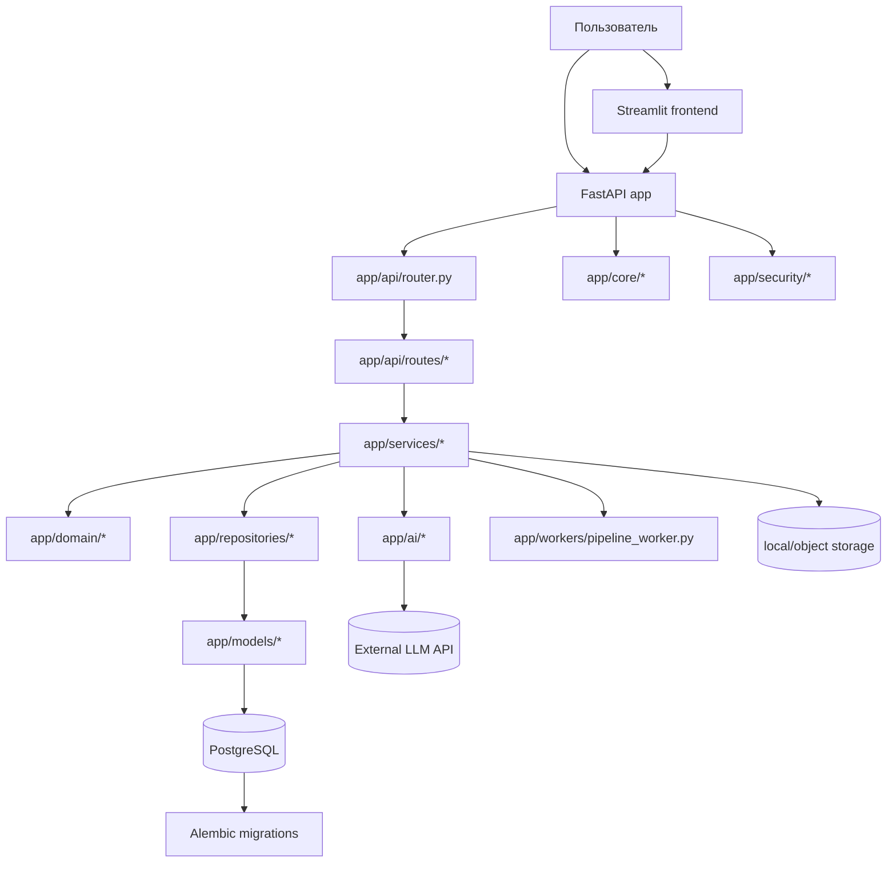

# Структура проекта

Документ описывает актуальную структуру `career-copilot`, роли основных папок и границы слоев backend. Проект построен вокруг FastAPI backend, Streamlit frontend, SQLAlchemy/Alembic persistence, AI orchestration и набора сервисов для career pipeline: профиль, вакансии, документы, заявки, интервью, readiness/evaluation и review loop.

## Общая архитектура


```mermaid
flowchart TD
    U[Пользователь] --> FE[Streamlit frontend]
    U --> API[FastAPI app]

    FE --> API
    API --> ROUTER[app/api/router.py]
    ROUTER --> ROUTES[app/api/routes/*]

    ROUTES --> SERVICES[app/services/*]
    SERVICES --> DOMAIN[app/domain/*]
    SERVICES --> REPOS[app/repositories/*]
    REPOS --> MODELS[app/models/*]
    MODELS --> DB[(PostgreSQL)]

    SERVICES --> AI[app/ai/*]
    AI --> LLM[(External LLM API)]

    SERVICES --> WORKER[app/workers/pipeline_worker.py]
    SERVICES --> STORAGE[(local/object storage)]

    API --> CORE[app/core/*]
    API --> SECURITY[app/security/*]
    DB --> ALEMBIC[Alembic migrations]
```

Основные правила зависимостей:

- `api/routes` принимают HTTP-запросы и делегируют работу сервисам.
- `services` содержат бизнес-логику и координируют repositories, domain-модели, AI use cases и storage.
- `domain` хранит чистые правила, статусы, value models, scoring/check registries и контракты пайплайнов.
- `repositories` изолируют SQLAlchemy-запросы.
- `models` содержат ORM-модели.
- `schemas` содержат Pydantic request/response contracts.
- `ai` инкапсулирует LLM clients, prompt registry, use cases, tracing и orchestrator.

## Корневая структура

```text
career-copilot/
├── app/                  # Backend: FastAPI, services, domain, repositories, AI
├── alembic/              # Alembic env и миграции БД
├── data/                 # Локальные данные и артефакты
├── docs/                 # Проектная и инженерная документация
├── frontend/             # Streamlit UI
├── infra/                # Docker/local infra
├── scripts/              # Локальные smoke/debug/dev утилиты
├── tests/                # Unit, service, API, e2e, migration и eval tests
├── README.md
├── MVP_RUNBOOK.md
├── RUNBOOK.md
├── pyproject.toml
├── alembic.ini
├── Dockerfile
└── build_backend.py
```

## Папка `app/`

```text
app/
├── ai/
├── api/
├── config/
├── core/
├── db/
├── domain/
├── models/
├── repositories/
├── schemas/
├── security/
├── services/
├── tasks/
├── workers/
├── workflows/
├── __init__.py
└── main.py
```

- `main.py` создает FastAPI-приложение, подключает API router, root endpoint и lifecycle.
- `config/` содержит прикладные настройки scoring/calibration.
- `core/` содержит общие настройки, logging и tracing.
- `db/` содержит SQLAlchemy Base, engine/session и dependency для DB session.
- `tasks/` и `workflows/` оставлены под расширение фоновых и orchestration сценариев.
- `workers/` содержит worker для pipeline jobs.

## `app/api/`

HTTP-слой приложения.

```text
app/api/
├── dependencies.py
├── router.py
└── routes/
    ├── applications.py
    ├── auth.py
    ├── documents.py
    ├── executions.py
    ├── files.py
    ├── health.py
    ├── interviews.py
    ├── pipeline_async.py
    ├── pipeline_execution_routes.py
    ├── profile.py
    ├── review_workspace_routes.py
    └── vacancies.py
```

- `router.py` собирает основные роутеры.
- `dependencies.py` содержит shared dependencies, включая текущего пользователя и AI orchestrator.
- `routes/auth.py` обслуживает register/login/refresh/logout/password reset/session flow.
- `routes/files.py` принимает upload файлов.
- `routes/profile.py` отвечает за импорт резюме, структурирование профиля и achievement review.
- `routes/vacancies.py` импортирует вакансии, запускает анализ и matching.
- `routes/documents.py` управляет генерацией, review, activation, rollback, diff и export документов.
- `routes/applications.py` управляет откликами и статусными переходами.
- `routes/interviews.py` управляет interview sessions, ответами, оценкой и coaching.
- `routes/pipeline_execution_routes.py`, `pipeline_async.py` и `executions.py` покрывают pipeline execution lifecycle, async запуск и события.
- `routes/review_workspace_routes.py` обслуживает human-in-the-loop review workspace.
- `routes/health.py` содержит healthcheck.

## `app/security/`

Security helpers для auth flow.

```text
app/security/
├── dependencies.py
├── passwords.py
└── tokens.py
```

- `dependencies.py` проверяет Bearer token и возвращает текущего активного пользователя.
- `passwords.py` содержит hashing/verification паролей.
- `tokens.py` генерирует access/refresh tokens и token hashes.

## `app/domain/`

Чистый доменный слой без ORM и HTTP.

```text
app/domain/
├── skills/
├── vacancies/
├── analytics_models.py
├── application_models.py
├── application_statuses.py
├── check_registry.py
├── checks.py
├── coverage_eval_models.py
├── coverage_models.py
├── document_models.py
├── evaluation_models.py
├── execution_event_payloads.py
├── execution_events.py
├── execution_metrics.py
├── interview_models.py
├── normalized_signals.py
├── pipeline_execution_status.py
├── pipeline_models.py
├── progress_models.py
├── readiness_evaluation.py
├── readiness_models.py
├── recommendation_models.py
├── requirement_models.py
├── retrieval_models.py
├── review_models.py
├── scoring_registry.py
├── signal_adapters.py
├── signal_normalizer.py
├── signals.py
├── star_models.py
└── trace_models.py
```

Ключевые области:

- statuses/transitions: `application_statuses.py`, `pipeline_execution_status.py`
- pipeline/progress/execution: `pipeline_models.py`, `progress_models.py`, `execution_events.py`, `execution_metrics.py`
- evaluation/readiness/recommendations: `evaluation_models.py`, `readiness_models.py`, `readiness_evaluation.py`, `recommendation_models.py`
- coverage/requirements/checks: `coverage_models.py`, `coverage_eval_models.py`, `requirement_models.py`, `check_registry.py`, `checks.py`
- signals/retrieval/STAR: `signals.py`, `normalized_signals.py`, `signal_normalizer.py`, `retrieval_models.py`, `star_models.py`
- applications/documents/interviews/review: `application_models.py`, `document_models.py`, `interview_models.py`, `review_models.py`
- skills/vacancies: справочники и helpers для skills catalog и vacancy fingerprinting.

## `app/models/`

ORM-модели SQLAlchemy.

```text
app/models/
├── entities.py
├── evaluation_snapshot.py
├── impact_measurement.py
├── pipeline_execution_event.py
├── recommendation.py
├── review_workflow.py
└── __init__.py
```

- `entities.py` содержит базовые таблицы пользователей, профилей, файлов, вакансий, документов, заявок, interview sessions, AI runs и auth/session сущностей.
- Отдельные модули выделяют evaluation snapshots, impact measurements, recommendation records, review workflow и pipeline execution events.

## `app/repositories/`

Слой доступа к данным.

```text
app/repositories/
├── ai_run_repository.py
├── application_event_repository.py
├── application_record_repository.py
├── application_status_history_repository.py
├── candidate_achievement_repository.py
├── candidate_profile_repository.py
├── document_version_repository.py
├── evaluation_repository.py
├── evaluation_snapshot_repository.py
├── file_extraction_repository.py
├── impact_measurement_repository.py
├── interview_session_repository.py
├── pipeline_execution_event_repository.py
├── pipeline_execution_repository.py
├── pipeline_repository.py
├── recommendation_repository.py
├── review_workflow_repository.py
├── source_file_repository.py
├── user_repository.py
├── vacancy_analysis_repository.py
└── vacancy_repository.py
```

Репозитории группируются вокруг тех же агрегатов, что и сервисы: user/profile/files, vacancies/analyses, documents, applications/events/status history, interviews, AI runs, pipeline executions/events, evaluation snapshots, recommendations, review workflow и impact measurements.

## `app/schemas/`

Pydantic request/response models и JSON contracts.

```text
app/schemas/
├── achievement_extract.py
├── application.py
├── auth.py
├── base.py
├── common_types.py
├── document.py
├── interview.py
├── json_contracts.py
├── pipeline_schemas.py
├── profile_import.py
├── profile_structured.py
├── resume_generation.py
├── review_workspace.py
├── source_file.py
└── vacancy.py
```

- `auth.py`, `application.py`, `document.py`, `interview.py`, `vacancy.py`, `source_file.py` описывают публичные API-контракты.
- `profile_import.py`, `profile_structured.py`, `achievement_extract.py`, `resume_generation.py` покрывают profile/resume flows.
- `pipeline_schemas.py` описывает pipeline execution responses.
- `review_workspace.py` описывает human-in-the-loop workspace.
- `json_contracts.py` содержит внутренние JSON-контракты для AI и interview flow.
- `base.py` и `common_types.py` содержат общие типы.

## `app/services/`

Основной слой бизнес-логики.

```text
app/services/
├── vacancy_text_extractors/
├── achievement_extraction_service.py
├── achievement_retrieval_service.py
├── answer_evaluation_engine.py
├── application_tracking_service.py
├── artifact_registry.py
├── auth_service.py
├── career_copilot_orchestrator.py
├── career_pipeline_orchestrator.py
├── cover_letter_generation_service.py
├── coverage_evaluator.py
├── coverage_mapping_service.py
├── deterministic_scoring_service.py
├── document_activation_service.py
├── document_builders.py
├── document_compat.py
├── document_diff_service.py
├── document_evaluator.py
├── document_feedback.py
├── document_mutation_service.py
├── document_review_service.py
├── document_rollback_service.py
├── document_serialization.py
├── document_validation_service.py
├── evaluation_analytics_service.py
├── evaluation_tracking_service.py
├── evidence_quality_service.py
├── impact_measurement_service.py
├── interview_preparation_service.py
├── interview_serialization.py
├── metrics_aggregator.py
├── password_reset_service.py
├── pipeline_execution_service.py
├── pipeline_job_queue.py
├── profile_builder_service.py
├── profile_import_service.py
├── profile_structuring_service.py
├── progress_tracking_service.py
├── readiness_evaluation_service.py
├── readiness_feature_extraction_service.py
├── readiness_scoring_service.py
├── recommendation_prioritization_service.py
├── recommendation_task_service.py
├── resume_generation_service.py
├── resume_parser_service.py
├── resume_renderer.py
├── retry_policy.py
├── review_action_loop.py
├── review_workspace_service.py
├── signal_normalizer.py
├── snapshot_comparison_service.py
├── snapshot_lineage_service.py
├── source_file_service.py
├── star_extraction_service.py
├── storage_service.py
├── trace_serialization.py
├── trend_service.py
├── vacancy_analysis_service.py
└── vacancy_import_service.py
```

Крупные группы сервисов:

- profile/source files: `source_file_service.py`, `storage_service.py`, `resume_parser_service.py`, `profile_import_service.py`, `profile_structuring_service.py`, `profile_builder_service.py`
- achievements/evidence/retrieval/STAR: `achievement_extraction_service.py`, `achievement_retrieval_service.py`, `evidence_quality_service.py`, `star_extraction_service.py`
- vacancies: `vacancy_import_service.py`, `vacancy_analysis_service.py`, `vacancy_text_extractors/`
- documents: `resume_generation_service.py`, `cover_letter_generation_service.py`, `resume_renderer.py`, `document_*`
- applications: `application_tracking_service.py`, `impact_measurement_service.py`
- interviews: `interview_preparation_service.py`, `answer_evaluation_engine.py`, `interview_serialization.py`
- pipeline/orchestration: `career_copilot_orchestrator.py`, `career_pipeline_orchestrator.py`, `pipeline_execution_service.py`, `pipeline_job_queue.py`, `retry_policy.py`, `artifact_registry.py`
- evaluation/readiness/recommendations: `readiness_*`, `evaluation_*`, `coverage_*`, `recommendation_*`, `metrics_aggregator.py`, `trend_service.py`
- review loop: `review_workspace_service.py`, `review_action_loop.py`
- signals/snapshots/traces: `signal_normalizer.py`, `snapshot_*`, `trace_serialization.py`
- auth: `auth_service.py`, `password_reset_service.py`

## `app/ai/`

LLM orchestration layer.

```text
app/ai/
├── clients/
│   ├── base.py
│   └── gigachat.py
├── registry/
│   └── prompts.py
├── use_cases/
│   ├── cover_letter_enhance.py
│   ├── interview_coach.py
│   ├── resume_enhance.py
│   └── resume_tailoring.py
├── config.py
├── factory.py
├── orchestrator.py
└── tracing.py
```

- `clients/` содержит абстрактный LLM-клиент и реализацию GigaChat.
- `registry/prompts.py` содержит версионированные prompt specs.
- `use_cases/` формируют prompt variables и вызывают orchestrator.
- `orchestrator.py` отвечает за retries, fallback, structured output, validation и tracing.
- `tracing.py` сохраняет AI runs.

Правило AI-слоя: роуты не вызывают AI напрямую. Сервисы обращаются к `app/ai/use_cases/`, а use cases вызывают `AIOrchestrator`.

## `frontend/`

Streamlit UI и HTTP-клиент.

```text
frontend/
└── streamlit/
    ├── api_client.py
    ├── app.py
    └── __init__.py
```

- `app.py` содержит MVP UI flow: профиль, достижения, вакансии, документы, заявки, интервью и review.
- `api_client.py` инкапсулирует backend API calls и export-запросы.

## `alembic/`

Миграции базы данных.

```text
alembic/
├── env.py
├── script.py.mako
└── versions/
```

- `env.py` подключает настройки проекта и SQLAlchemy metadata.
- `versions/` содержит миграции схемы, включая auth, documents, applications, pipeline executions, events, evaluation snapshots, recommendations, review workflow и impact measurements.

## `docs/`

Проектная документация.

```text
docs/
├── engineering/
│   └── transaction-boundaries.md
├── document_mutation_service.md
├── evaluation_snapshot_migration.md
├── local-operational-routine.md
├── PipelineExecutionQuickStart.md
├── PipelineExecutionTracking.md
├── project-structure.md
├── readiness_evaluation_integration.md
├── readiness_evaluation_service.md
└── recommendation_categories.md
```

- `project-structure.md` - этот документ.
- `local-operational-routine.md` - локальные эксплуатационные инструкции.
- `PipelineExecution*.md` - документация execution tracking.
- `readiness_*` и `recommendation_categories.md` - документация evaluation/readiness/recommendation областей.
- `document_mutation_service.md` - документация mutation flow для документов.
- `engineering/transaction-boundaries.md` - инженерные правила транзакционных границ.

## `scripts/`

Локальные утилиты.

```text
scripts/
├── check_ai_runs.py
├── debug_vacancy_analysis_parser.py
├── dev_db_counts.py
├── dev_db_reset.py
├── import_analyze_vacancy_utf8.py
├── list_recent_vacancy_analyses.py
├── smoke_mvp_flow.py
├── test_orchestrator_break.py
├── test_orchestrator_manual.py
└── verify_pdf_extraction_utf8.py
```

- smoke/dev scripts помогают проверять MVP flow, состояние БД, AI runs, vacancy parsing и PDF/text extraction.

## `infra/`

Инфраструктурные файлы.

```text
infra/
└── docker/
    └── docker-compose.yml
```

Docker Compose используется для локального окружения.

## `tests/`

Тесты проекта.

```text
tests/
├── fixtures/
│   └── vacancy_html/
├── evals/
├── conftest.py
└── test_*.py
```

Основные группы:

- API/service tests для auth, profile, vacancies, documents, applications, interviews, pipeline executions и execution events.
- Document tests для generation, enhance, review, activation, rollback, diff, export и content JSON audit.
- Application tests для package integrity, list API, status transitions и timeline/history.
- Pipeline tests для sync/async execution и event tracking.
- AI tests для orchestrator, model override, prompt rendering и registry integrity.
- Migration tests для drift checks.
- E2E/smoke tests для MVP flow.
- `tests/evals/` покрывает evaluation models/repositories/services, readiness scoring, coverage mapping, recommendations, review action loop, retry policy, progress tracking, snapshots, signals, retrieval и STAR models.

## Основные потоки данных

### 1. Загрузка и импорт профиля

1. Клиент загружает файл через `files` API.
2. `SourceFileService` сохраняет файл через `StorageService` и создает `SourceFile`.
3. `ProfileImportService` читает source file и запускает parsing.
4. `ProfileStructuringService` строит структурированный профиль.
5. `AchievementExtractionService` извлекает достижения и переводит их в review flow.

### 2. Вакансия и анализ

1. Клиент импортирует вакансию из текста или URL.
2. `VacancyImportService` создает `Vacancy`.
3. `VacancyAnalysisService` анализирует требования и сопоставляет вакансию с профилем.
4. Результат сохраняется через vacancy analysis repository.

### 3. Документы

1. `ResumeGenerationService` или `CoverLetterGenerationService` собирает профиль, вакансию, анализ и подтвержденные достижения.
2. AI use case вызывает `AIOrchestrator`.
3. Создается `DocumentVersion`.
4. Документ проходит review, mutation/evaluation, activation, rollback или export.
5. `DocumentActivationService` поддерживает invariant: одна активная версия в scope `(user + vacancy + document_kind)`.

### 4. Заявки

1. `ApplicationTrackingService` создает application record.
2. Статусы обновляются только по разрешенным переходам.
3. История переходов и application events сохраняются отдельно.
4. Application package integrity проверяет, что документы готовы к отклику.

### 5. Интервью

1. `InterviewPreparationService` создает interview session и вопросы.
2. Пользователь сохраняет ответы.
3. `AnswerEvaluationEngine` и interview services считают feedback/readiness.
4. AI coach может улучшать ответы и давать прогресс по вопросу.

### 6. Pipeline execution

1. Pipeline routes или async route запускают career pipeline.
2. `CareerPipelineOrchestrator`/`CareerCopilotOrchestrator` координируют шаги.
3. `PipelineExecutionService` и repositories сохраняют execution, events, progress, artifacts и readiness.
4. `pipeline_worker.py` обрабатывает фоновые jobs из `PipelineJobQueue`.

### 7. Evaluation, readiness и recommendations

1. Сервисы evaluation/readiness собирают сигналы из профиля, вакансии, документов и pipeline artifacts.
2. Coverage/evidence/signal services нормализуют данные.
3. Recommendation services создают и приоритизируют actionable tasks.
4. Snapshot services поддерживают lineage и comparison между evaluation snapshots.

## Текущий healthcheck

- `GET /health`
- ожидаемый ответ: `{"status":"ok"}`
